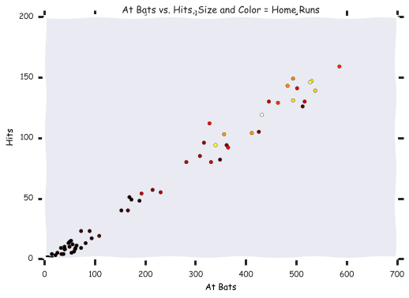

# Instructional Set - Plotting with matplotlib and pandas

_Sources include: [Research
Computing](http://nbviewer.ipython.org/github/ResearchComputing/Meetup-
Fall-2013/blob/master/python/lecture_17_matplotlib.ipynb), [Harvard CS109](http:
//nbviewer.ipython.org/github/cs109/content/blob/master/lec_03_statistical_graph
s.ipynb),[Chris Fonnesbeck](http://nbviewer.ipython.org/urls/gist.github.com/fon
nesbeck/5850463/raw/a29d9ffb863bfab09ff6c1fc853e1d5bf69fe3e4/3.+Plotting+and+Vis
ualization.ipynb) and the [MatPlotLib
documentation](http://nbviewer.ipython.org/github/ResearchComputing/Meetup-
Fall-2013/blob/master/python/lecture_17_matplotlib.ipynb)_

## What we will cover:

* Plotting with Pandas
  * Line Plots
  * Bar Plots
  * Histograms
  * Subplots

* Plotting with MatPlotLib
  * Syntax - basic plots and subplots
  * Scatter Plots

##Built-in Plotting Functionality with Pandas

* Pandas plotting is built with Matplotlib
* Pandas dataframes already include row and column label and grouping, so allow
for more concise plotting statements.

    %pylab inline

    Populating the interactive namespace from numpy and matplotlib

    from pandas import *

    # Subplotting example
    a = randn(50).cumsum()
    b = randn(50).cumsum()
    c = randn(50).cumsum()

    df=DataFrame({'a':a,'b':b,'c':c})

    df.plot(subplots=True)

    df.plot()

    # Adding options
    #Generate a random graph 
    a = randn(50).cumsum()

    df = DataFrame(a) # convert it to a dataframe

    df.plot(title='Random Plot',kind='line')

    # Pandas data frames have a built in plot function with defaults:
    df = DataFrame(np.random.randn(10, 4).cumsum(0),
    columns=['A', 'B', 'C', 'D'],
    index=np.arange(0, 100, 10))

    df

    df.plot(title='Plot automatically finds Indexes and Places Labels')

###Bar plots

    titanic = read_csv("data/titanic.csv")

    titanic

    SurvivedByClass=titanic.groupby('pclass').survived.sum()

    SurvivedByClass

    SurvivedByClass.plot(kind='bar',title='Titanic Survivors by Class')

    # Combine multiple groups and plot
    titanic.groupby(['sex','pclass']).survived.sum().plot(kind='barh',title='Titanic Survivors by Class and Gender')

    # Plot CrossTabs
    death_counts = crosstab([titanic.pclass, titanic.sex], titanic.survived.astype(bool))

    death_counts.plot(kind='bar', stacked=True, title='Passenger Outcomes by Gender and Class', color=['white','blue'], grid=False)

    

###Histograms and Density Plots

    # Histogram of a particular column
    titanic.fare.hist(grid=False,bins=25,range=(0,100))

    # Density plot -- Estimate the 'true' distribution
    titanic.fare.dropna().plot(kind='kde', xlim=(0,100))

    titanic.fare.hist(bins=25, normed=True, color='lightseagreen')

    titanic.fare.plot(kind='kde', xlim=(0,600), style='r--')

    titanic.boxplot(column='fare',by='pclass',grid=False)

    # Combine pandas plots by running them together -- if pandas thinks they can be overlapped, it will
    titanic.fare.hist(bins=25, normed=True, color='lightseagreen')
    titanic.fare.plot(kind='kde', xlim=(0,100), style='r--')
    titanic.boxplot(column='fare',by='pclass',grid=False)

    

## Matplotlib

### Figures and Subplots

    import matplotlib.pyplot as plt

    x = np.arange(50)
    y = np.random.randn(50)
    plt.scatter(x,y)

    

    %pylab inline

    #Single Plot
    a = randn(50).cumsum()
    
    plt.plot(a, color='red')

    

    

    fig = figure()
    
    # Two rows, one column, first plot
    ax1 = fig.add_subplot(2,1,1)
    ax1.plot(a, color='red')
    
    #Two rows, one column, second plot
    ax2 = fig.add_subplot(2,1,2)
    ax2.scatter(np.arange(50), randn(50))
    
    # Exercise: Try 1 row, two columns
    # Exercise: Try 1 row, one column

*fig* is the :class:`matplotlib.figure.Figure` object

*ax* can be either a single axis object or an array of axis
objects if more than one subplot was created.  The dimensions
of the resulting array can be controlled with the squeeze
keyword, see above.

    fig, ax = plt.subplots(2,3)
    
    ax[0,1].plot(randn(50), color='green', linestyle='-')
    ax[1,2].scatter(np.arange(50), randn(50), color='red')
    ax[1,0].hist(randn(1000))
    plt.show() #Similar to print()
    

    

    
    # Exercise: Swap the top row and bottom row plots
    # Excecise: Change the line style to dotted and add circles as markers 
    # Exercise: change the bins to 100 for the histogram

###Ticks, Labels and Legends

    fig = plt.figure(); ax = fig.add_subplot(1, 1, 1)
    ax.plot(randn(1000).cumsum(), 'k', label='one') 
    ax.plot(randn(1000).cumsum(), 'k--', label='two')
    ax.plot(randn(1000).cumsum(), 'k.', label='three')
    ax.set_title('Three random lines')
    ax.legend(loc='best')
    plt.show()
    
    #Exercise: Change the color and line style of each line using the minimum amount of characters

    # Save the file
    plt.savefig('ThreeRandomLines.pdf')

    <matplotlib.figure.Figure at 0x10494e990>

    %pylab inline

    Populating the interactive namespace from numpy and matplotlib

    import pandas as pd

    ### ScatterPlots from Data Frames

    # Combine pandas with matplotlib for scatterplots
    baseball = pd.read_csv("data/baseball.csv")
    #Offensive Statistics from MLB -- 2008.  Glossary: http://www.baseballprospectus.com/glossary/index.php?context=all&category=true
    
    baseball.head()

<pre>
&lt;class 'pandas.core.frame.DataFrame'&gt;
Int64Index: 5 entries, 0 to 4
Data columns (total 23 columns):
id        5  non-null values
player    5  non-null values
year      5  non-null values
stint     5  non-null values
team      5  non-null values
lg        5  non-null values
g         5  non-null values
ab        5  non-null values
r         5  non-null values
h         5  non-null values
X2b       5  non-null values
X3b       5  non-null values
hr        5  non-null values
rbi       5  non-null values
sb        5  non-null values
cs        5  non-null values
bb        5  non-null values
so        5  non-null values
ibb       5  non-null values
hbp       5  non-null values
sh        5  non-null values
sf        5  non-null values
gidp      5  non-null values
dtypes: float64(9), int64(11), object(3)
</pre>

    

    fig = plt.figure()
    ax = fig.add_subplot(1,1,1) # one row, one column, first plot
    ax.set_title("Hits vs. At Bats")
    ax.set_xlabel("At Bats")
    ax.set_ylabel("Hits")
    ax.scatter(baseball.ab, baseball.h) 

    <matplotlib.collections.PathCollection at 0x1063b18d0>

    fig = plt.figure()
    ax = fig.add_subplot(1,1,1) # one row, one column, first plot
    ax.set_title("At Bats vs. Hits.  Size = Home Runs")
    ax.set_xlabel("At Bats")
    ax.set_ylabel("Hits")
    plt.scatter(baseball.ab, baseball.h, s=baseball.hr*10, alpha=0.5)
    xlim(0, 700); ylim(0, 200)

    (0, 200)

    baseball

    xkcd()
    #plt.scatter(baseball.ab, baseball.h, c=baseball.hr, s=40, cmap='hot')
    fig = plt.figure()
    ax = fig.add_subplot(1,1,1) # one row, one column, first plot
    ax.set_title("At Bats vs. Hits, Size and Color = Home Runs")
    ax.set_xlabel("At Bats")
    ax.set_ylabel("Hits")
    plt.scatter(baseball.ab, baseball.h, c=baseball.hr,cmap='hot')
    xlim(0, 700); ylim(0, 200)

    (0, 200)

## Other Packages

    

### Seaborn

    #With Titanic Data
    import seaborn as sns
    sns.set(style="darkgrid")
    
    df = sns.load_dataset("titanic")
    
    pal = dict(male="#6495ED", female="#F08080")
    g = sns.lmplot("age", "survived", col="sex", hue="sex", data=df,
                   palette=pal, y_jitter=.02, logistic=True)
    g.set(xlim=(0, 80), ylim=(-.05, 1.05))

    <seaborn.axisgrid.FacetGrid at 0x109c37b90>

    # Seaborn with Anscombe Data
    import seaborn as sns
    sns.set(style="ticks")
    
    df = sns.load_dataset("anscombe")
    sns.lmplot("x", "y", col="dataset", hue="dataset", data=df,
               col_wrap=2, ci=None, palette="muted", size=4,
               scatter_kws={"s": 50, "alpha": 1})

    

#### Other packages

vincent: wraps vega and is built on d3 -- javascript capabilities
bokeh: Interactive plots (javascript)
ggplot: (similar to R ggplot)

## Practice

If one of your group has a datset for your independent assignment:

Create a plot of some features of the dataset, include title, axes labels
* Include titles and axes labels
* Include multiple variables, either on different or one one chart.
* Include data subsets

Or: Using Titanic, Baseball, or one of these [example
datasets](http://vincentarelbundock.github.io/Rdatasets/datasets.html), ask a
question that can be answered through visualization, and create the graph that
provides the answer.
* Include titles and axes labels
* Include multiple variables, either on different or one one chart.
* Include data subsets

At the end of the period, we will go over two of the works in progress, and
discuss ways of creating or improving the plots

BONUS: Load Anscombe's Quartet and Create a Grid with a Scatter and Line Graph
of Each
[Anscombe's Quartet
Data](http://vincentarelbundock.github.io/Rdatasets/csv/datasets/anscombe.csv)

